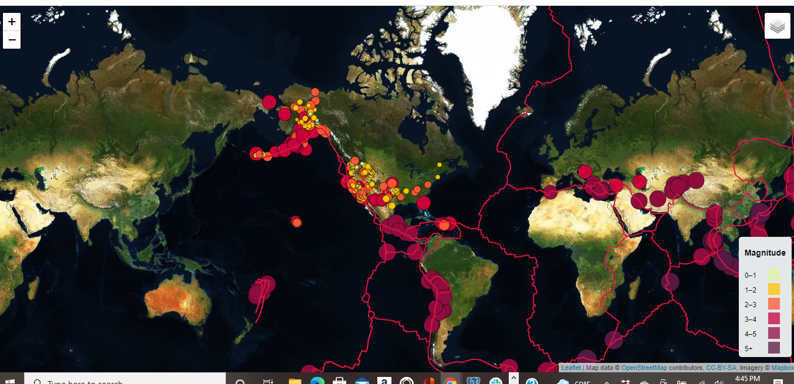

# Leaflet-Challenge
The USGS provides earthquake data in a number of different formats, updated every 5 minutes. Visit the [USGS GeoJSON Feed](http://earthquake.usgs.gov/earthquakes/feed/v1.0/geojson.php) page and pick a data set to visualize. When you click on a data set, for example "All Earthquakes from the Past 7 Days", you will be given a JSON representation of that data. You will use the URL of this JSON to pull in the data for our visualization.

1.  Creating  maps using Leaflet that plots all of the earthquakes from the data set based on their longitude and latitude.

   * Data markers  reflects the magnitude of the earthquake by their size and and depth of the earthquake by color. Earthquakes with higher magnitudes appears     
   * larger and earthquakes with greater depth  appears darker in color.

   * The depth of the earth can be found as the third coordinate for each earthquake.

   * Popups provides additional information about the earthquake when a marker is clicked.

   * legends are created that  provides context for map data.

2.Plotting a second data set on your map  illustrating the relationship between tectonic plates and seismic activity.Pulling  in a second data set 

  and visualizing it alongside your original set of data. Data on tectonic plates can be found at <https://github.com/fraxen/tectonicplates>.

In this step :

* I Plot a second data set on the map.

* And added a number of base maps to choose from as well as separate out  two different data sets into overlays that can be turned on and off independently.

* And added layer controls to our map.
